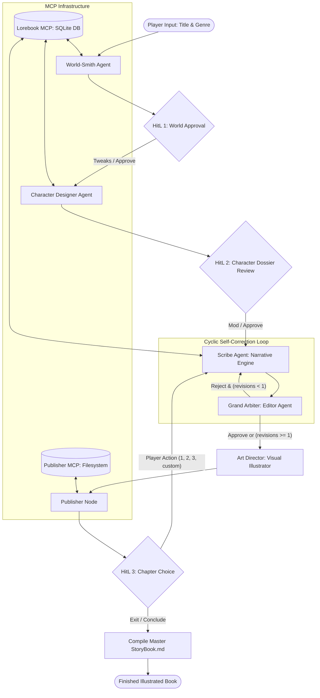

# 📖 TaleWeaver: Agentic Interactive Story Forge & Book Engine

An enterprise-grade, multi-agent interactive text adventure and automated storybook generator built with **LangGraph** and **Model Context Protocol (MCP)**. TaleWeaver seamlessly combines cyclic self-correcting agent loops, multi-stage human-in-the-loop (HitL) decision gateways, persistent SQLite lore storage, and filesystem publishing—designed to run completely within free-tier API quotas.

---

## 🏛️ System Architecture



---

## 🎭 The 5 Specialized Agents

| Agent Persona | Role & Responsibilities | Key Outputs |
| :--- | :--- | :--- |
| **The World-Smith** *(Architect)* | Establishes atmosphere, physics/magic laws, and primary conflict. Syncs world rules to Lorebook MCP. | `WorldLore` Pydantic schema |
| **The Character Designer** | Generates multi-layered characters (Protagonist, Companion, Antagonist) with traits and inventory. Adapts to player feedback. | `CharacterProfile` roster |
| **The Scribe** | Drafts 300–500 words of rich prose using rolling context + Lorebook. Concludes on a cliffhanger with 3 divergent options. | `ChapterDraft` with `StoryChoice` items |
| **The Grand Arbiter** *(Editor)* | Evaluates genre fidelity, character consistency, and choice divergence. Capped at 1 revision pass to prevent token exhaustion. | `EditorCritique` (Score 1-10 & fixes) |
| **The Visual Illustrator** *(Art Director)* | Extracts the most iconic dramatic scene and creates high-detail prompts for concept art generation. | `IllustrationPrompt` |

---

## 🔌 Model Context Protocol (MCP) Integration

TaleWeaver leverages the standardized **Model Context Protocol (MCP 2.x)** across 3 decoupled server subsystems:

1. **`lore_server.py` (SQLite Canon Database MCP):**
   - Stores canonical world lore, character dossiers, physical/emotional status, inventory log, and milestones.
   - Tools: `store_world_lore`, `register_character`, `update_character_status`, `record_inventory_change`, `query_lore`.
2. **`rules_server.py` (World Physics & Consistency MCP):**
   - Validates character actions against live inventory and resolves deterministic d20 skill checks against Difficulty Classes (DC).
   - Tools: `validate_inventory_action`, `resolve_skill_check`, `advance_world_clock`.
3. **`publisher_server.py` (Filesystem & eBook MCP):**
   - Formats approved chapter prose and visual prompts, assembling both `StoryBook.md` and a responsive standalone `StoryBook.html` reader.
   - Tools: `publish_chapter`, `compile_storybook`, `read_storybook`.

---

## ⏳ LangGraph Time-Travel & Multiverse Branching

Built on LangGraph's `SqliteSaver` checkpoint engine, TaleWeaver supports full state time-travel:
- **Checkpoint History:** Every chapter, decision point, and approval pause is permanently checkpointed.
- **Multiverse Forking:** Users can inspect past chapter snapshots and fork into an alternative narrative branch (`fork_story_branch`), testing "what if" choices without losing the original timeline.
- **Interactive Web Console:** Run `uv run uvicorn taleweaver.server:app --reload` to explore the visual pipeline, inspect timeline checkpoints, and check character dossiers.

---

## 🛡️ Free-Tier Quota & API Protection

TaleWeaver includes built-in safeguards to operate reliably on free-tier LLM quotas:
- **Strict Revision Caps:** Scribe-Editor loops are capped at a maximum of `max_revisions = 1` per chapter.
- **Sliding-Window State Compaction:** Conversation logs are never sent raw. State is continuously compacted into a lightweight `rolling_summary`, and specific historical facts are retrieved on-demand via the Lorebook MCP.
- **Paced API Throttler:** Built-in `RateLimiter` enforces minimum delays between calls (default 4.0s) to keep requests comfortably beneath the 15 RPM limit.
- **Strict Pydantic Schemas:** All agent completions use constrained schemas to guarantee concise generation and eliminate parsing errors.

---

## 🚀 Quickstart & Installation

TaleWeaver uses **`uv`** for lightning-fast, reproducible dependency management.

### 1. Clone & Enter Project
```bash
git clone https://github.com/yashaswigarg/TaleWeaver.git
cd TaleWeaver
```

### 2. Configure Environment
Create a `.env` file from `.env.example`:
```bash
cp .env.example .env
```
Edit `.env` to include your API key:
```ini
GEMINI_API_KEY=your_gemini_api_key_here
TALEWEAVER_MODEL=gemini-3.6-flash
TALEWEAVER_RATE_LIMIT_DELAY=4.0
TALEWEAVER_MAX_REVISIONS=1
```

### 3. Run the Game
```bash
uv run taleweaver
```
*(Or invoke via python module: `uv run python -m taleweaver.main`)*

---

## 🎮 Gameplay Flow

1. **Title, Genre & Custom Storyline:** 
   - Input your Title and Genre.
   - Enter an optional **Storyline / Context** (e.g. *"Mona lives in a traditional countryside village with her house, school, fields, and market, later taking an exciting trip to Tokyo with her family"*).
   - Select your target chapter length (e.g. 3 chapters quick tale, 5 chapters standard book).
2. **HitL Gateway 1 (World & Storyline Approval):** Review the generated world card and user storyline alignment. Accept or type custom tweaks to reshape the realm.
3. **HitL Gateway 2 (Character Review):** Inspect your Protagonist, Companion, and Antagonist cards. Tweak stats, names, or starter items.
4. **Interactive Chapters & Dynamic Inventory:** Read newly drafted chapters, explore the Art Director's visual prompts, and select choices **[1]**, **[2]**, **[3]**, or write any custom decision. As the plot progresses, character inventories update automatically in the Lorebook!
5. **Grand Finale & Dual Book Publishing:** Once the story reaches its climax or you type `quit`, TaleWeaver automatically compiles:
   - 📖 **`data/StoryBook.md`:** Clean, formatted Markdown edition.
   - 🌐 **`data/StoryBook.html`:** Beautiful, standalone, dark-themed responsive eBook with elegant Cinzel & Crimson Pro typography, table of contents, and illustration concept cards!

---

## 🧪 Test Suite

Run the full automated test suite (16 unit & integration tests) covering state schemas, rate limiters, MCP database and filesystem tools, storyline context, and full graph execution:
```bash
uv run pytest
```
